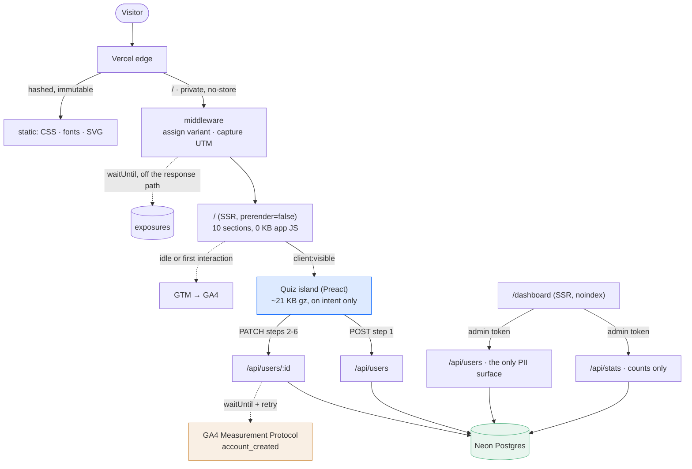

# Architecture

What this is made of and why. Decisions are numbered `D1`–`D44` and live in
[`decisions.md`](decisions.md); this file links rather than restates them.

## Shape

A static marketing site with exactly one dynamic page, one island and two write
endpoints. Everything that can be zero JavaScript is zero JavaScript.



```
src/
  middleware.ts          variant assignment, UTM capture, exposure write
  pages/
    index.astro          the landing — SSR per request
    dashboard.astro      internal readout, token-gated
    api/users/index.ts   POST (signup) · GET (admin listing)
    api/users/[id].ts    PATCH (answers, conversion, account_created)
    api/stats.ts         the experiment readout, counts only
  components/            .astro sections, zero JS · quiz/ is the one island
  content/               all copy, typed, mirrored from messaging.md
  lib/
    variants.ts          assignment, QA flagging
    schemas.ts           Zod (mini), shared by island and server
    plan.ts              answers → plan, pure
    stats.ts             Wilson · lift · chi-square
    decision.ts          the experiment.md rules, as a function
    analytics/           typed events · track() · Measurement Protocol
    db/                  Drizzle schema and client
```

## The decisions that shaped it

| Area | Choice | Why | Cost |
|---|---|---|---|
| Rendering | `/` server-rendered per request (**D16**) | Variant assigned server-side, no flicker, one page and one copy source | `/` is a function, not a CDN hit: ~70 ms server time. ISR unusable — it would cache one arm |
| Framework | Preact, not React (**D29**) | Measured: React 19 + react-dom is 67 KB gzip for a one-button probe, against a 60 KB budget | `compat: true`, so the island is ordinary React and moving back is a config line |
| Validation | `zod/mini`, shared client and server (**D30**) | Classic Zod does not tree-shake — 80 KB into the island | Wordier functional API |
| Experiment | Exposures in their own Postgres table (**D17**) | Both sides of conversions ÷ exposures come from the same sink. GA4 as the denominator would inflate the rate by whatever ad blockers eat | One insert per new visitor, behind `waitUntil` |
| Analytics | `account_created` server-side (**D35**, **D43**) | The one event that cannot be lost to an ad blocker or a closed tab | Needs a GA4 client id; derived from `anonymous_id` when absent, losing session attribution |
| QA | Anything non-production is `is_qa: true` (**D18**) | Previews get clicked during review; without this every QA pass contaminates an arm | Production is the only environment producing analysable data |
| Admin | `/api/stats` has no PII at all (**D37**) | "The agent must not print emails" is a rule that can be broken; "there are no emails here" is a property | Two endpoints where one would do |

## API

Four routes, documented in [`api.md`](api.md). The shape follows from three
rules:

**The server never trusts the client.** The experiment arm comes from the
assignment cookie, never the request body — the body value exists only so a
mismatch can be logged. Schemas are `.strictObject`, so an unexpected field is a
422 rather than silently ignored data.

**Identity is a capability, not a guess.** `PATCH /api/users/:id` needs the
`fxr_edit` cookie issued at step 1, stored hashed and compared in constant time.
Knowing a user's id is not enough to edit it.

**The database enforces what matters.** Email uniqueness is a partial unique
index, not an app-level check racing itself. A duplicate converges on the
documented 409 whether it is caught by the query or by the constraint.

Errors use one envelope and one status map, built in `lib/api/respond.ts`, so
the contract is a property of the API rather than something each handler
remembers.

## Deploy

`git push` → Vercel builds → preview URL per branch, `main` is production.
Deploys are never manual (**D14**, **D15**), so every deploy is traceable to a
commit. GitHub Actions runs types, build and unit tests on every PR; e2e runs
against a deployment rather than a local server, because Astro 7's dev server
detaches and Playwright reads that as a crash (**D21**).

Migrations are Drizzle files applied over the unpooled connection; the app uses
the pooled one.

## Infrastructure

| | Today | Why it is enough here |
|---|---|---|
| Hosting | Vercel, Node serverless functions | The adapter, previews per branch and `waitUntil` are all load-bearing |
| Data | Neon Postgres, free tier, one database | Serverless-friendly over HTTP; no connection pool to exhaust |
| CI/CD | GitHub Actions → Vercel on push | Types, build and unit tests gate the PR |
| DNS | `*.vercel.app` | No custom domain for a take-home |
| CDN / cache | Static assets immutable via `vercel.json`; `/` is `private, no-store` | A cached `/` would pin every visitor to one arm — a correctness constraint, not tuning |
| Observability | Server logs; `/api/stats` as the product-level readout | Vercel's dashboard is read by a human (**D15**) |
| Security | Secrets in env vars only; admin token never in a URL (**D36**); edit tokens hashed; honeypot on signup; no PII in analytics | The surfaces that can leak a person are two, and both need a token |
| Reliability | Analytics failures never fail a request; steps 2–5 save in the background and are retried; the conversion carries whatever is still owed | A flaky connection mid-quiz costs no answers |

## What would change for a real FX Replay system

Ordered by what I would do first.

1. **Real authentication.** The signup is simulated and the dashboard shares one
   token. Both become the real account service with roles and per-person
   sessions. This is the largest gap and the least interesting to fake.
2. **Rate limiting and bot defence at the edge.** Today: a honeypot and a
   user-agent heuristic. Production: per-IP and per-`anonymous_id` limits on
   `POST /api/users`, and a managed challenge — a public signup endpoint is
   abused within days.
3. **An outbox for GA4.** `account_created` retries inside `waitUntil`, which
   covers a transient failure and not an outage. A durable outbox table with a
   worker makes delivery a property of the system rather than of one request.
4. **Feature flags instead of a hand-rolled assigner.** The variant logic is
   ~60 lines and correct, but a real team wants mutually exclusive experiments,
   holdouts and a kill switch that does not need a deploy. That is a platform
   (`ai-workflow.md` names PostHog), not more code here.
5. **PII retention.** Emails live in Postgres indefinitely. Production needs a
   deletion path and a retention window, which is a legal requirement before it
   is an engineering one.
6. **Field data, not lab data.** Every performance number here is synthetic.
   Real CrUX or Vercel Web Analytics turns the LCP p75 guardrail in
   [`experiment.md`](experiment.md) from a plan into a measurement.
7. **Warehouse the funnel.** One Postgres serves the app and the readout. At
   real volume the readout moves to a warehouse so an analyst's query cannot
   compete with a signup for the same connection.

## What I would not change

The parts that look like shortcuts and are not:

- **Deterministic plan rules** rather than an LLM. Free, instant, testable, and
  incapable of inventing a promise the copy guardrails forbid.
- **Zero JavaScript on the marketing page.** The island earns its bytes at the
  moment of conversion; nothing else does.
- **Exposures in Postgres.** The denominator has to be as exact as the
  numerator, or the ratio is decoration.
